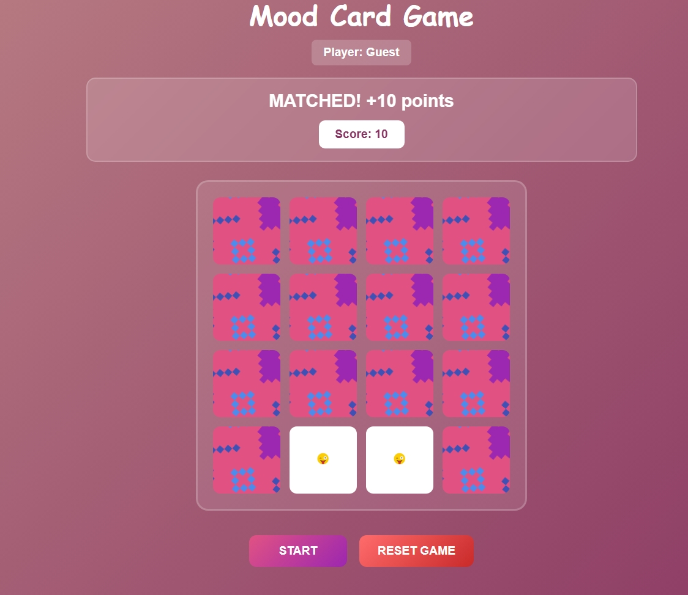
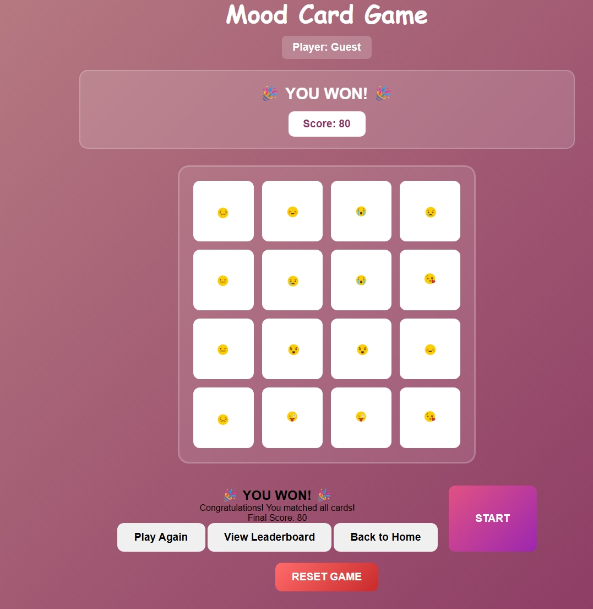

## Mood card game

#### Date
5-2-2026

## Author
Zainab Salman

#### Connect with me :
* [Git hub] (https://github.com/ZELDA3)

* [Linkedin] (https://www.linkedin.com/in/zainab-salman-832213179?utm_source=share&utm_campaign=share_via&utm_content=profile&utm_medium=android_app)

* [instagram] (https://www.instagram.com/zainab.salman.380_?igsh=MWtqdTF0aXh2ZjJ5Ng==)

***
need to add the deployment link in read me

#### ***Description***
Mood Card is a fast-paced memory game designed to sharpen your cognitive focus under pressure,
The goal is simple but demanding: memorize the changing patterns in a flash and react before time runs out.
Do you have the mental stamina to top the leaderboard? (only top 10 are visible)

***

#### Technologies
* HTML
* CSS
* Javascript

### ​how does the game look like ?
**![wireframe] ()**
**![Instructions&User] ()**
**![Memorize] ()**
**![Matching] ()**
**![Game completed] ()**

# Visit the game and try it out !*[https://mood-card-game.surge.sh]

## Getting Started
**To get started on with this Game follow these steps**
1. **Read the game instructions and enter a username to begin**
2. **​Match or identify 3 pairs within 15 seconds to qualify you for the next level**
3. **​Your score and remaining lives are displayed at the top middle of the screen**

### ***Future Updates***
- [ ] 6 more characters will be added each update.
- [ ] Offline version will be available soon.
- [ ] Sound control for music.
- [ ] Extra levels will be included.
- [ ] Customization ( users who are creative will get their character verified )

### ***this is an alpha version, beta will be tested and published as ver 2.0 ***

### ***Credits***
**![used this toturial for the pattern also to get the images on an assets/json file] : [https://youtu.be/xWdkt6KSirw?si=WNNiUXIU34qlRvIP]**
**![These 7 steps that we used in tic tac toe helped me with structuring my javascript] : [https://pages.git.generalassemb.ly/modular-curriculum-all-courses/javascript-browser-game-tic-tac-toe-lab/canvas-landing-pages/seb]**
